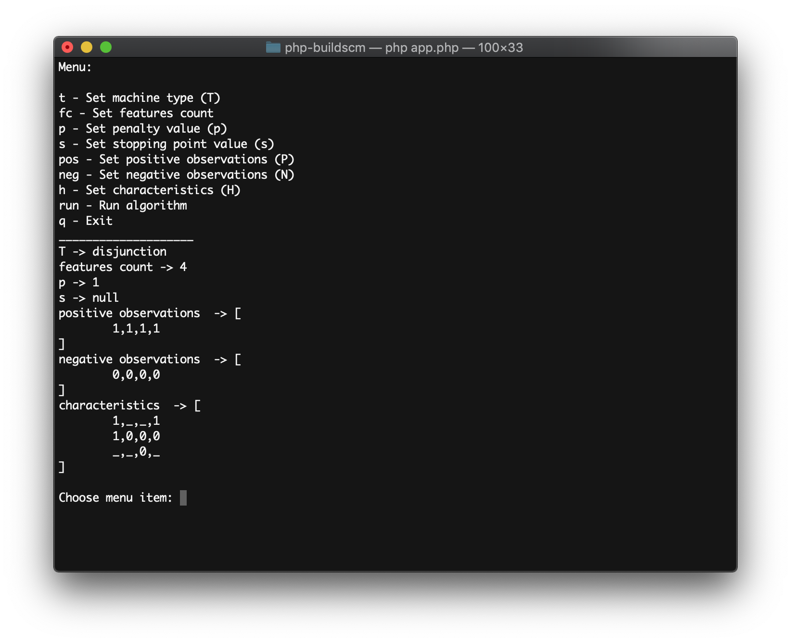
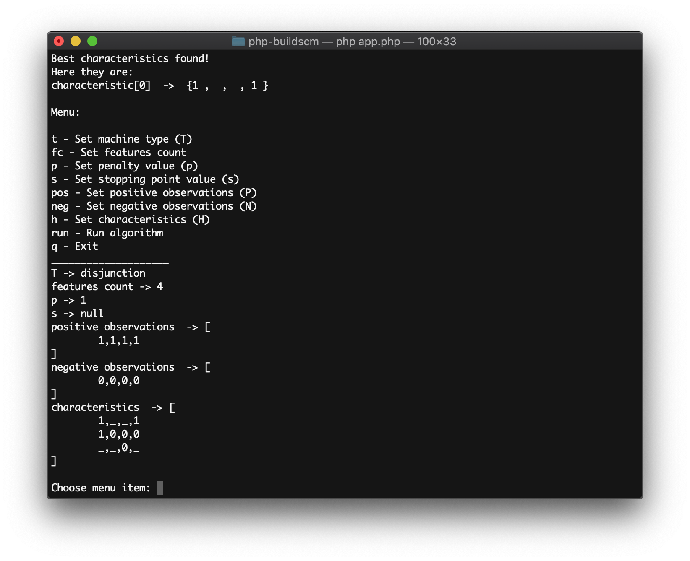

# php-buildscm
PHP interpretation of BuildSCM Algorithm

## The Set Covering Machine Abstract
[Read](http://www.jmlr.org/papers/volume3/marchand02a/marchand02a.pdf)
>Written by:  
>Mario Marchand (School of Information Technology and Engineering, University of Ottawa)  
>John Shawe-Taylor (Department of Computer Science, Royal Holloway, University of London)  


## Launch
```php app.php```

## Usage
There is a simple cli menu so using the app must not be a problem.  
To run algorithm the following data must be set:  
```text
* positive observations  
* negative observations
* characteristics
```
Observations and characteristics are determined as a sets of binary features.  
Observation example (|features| = 5):  
`1 0 1 1 1`  
Characteristics example (|features| = 5):  
`_ 0 _ _ 1`  
Underscore symbol means ANY value (0 or 1).


After data preparation type 'run' and hit enter.


 
